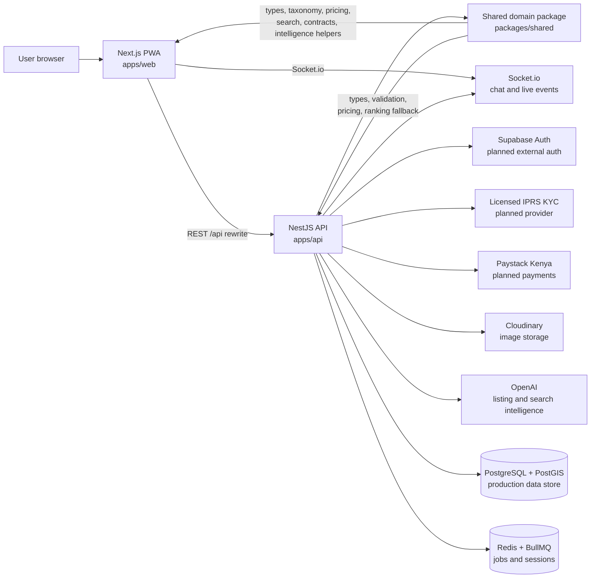
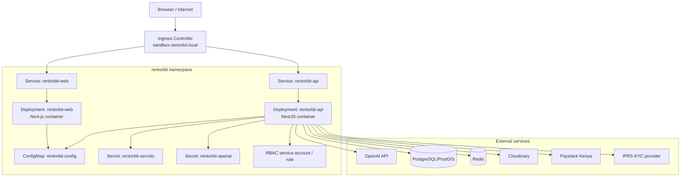
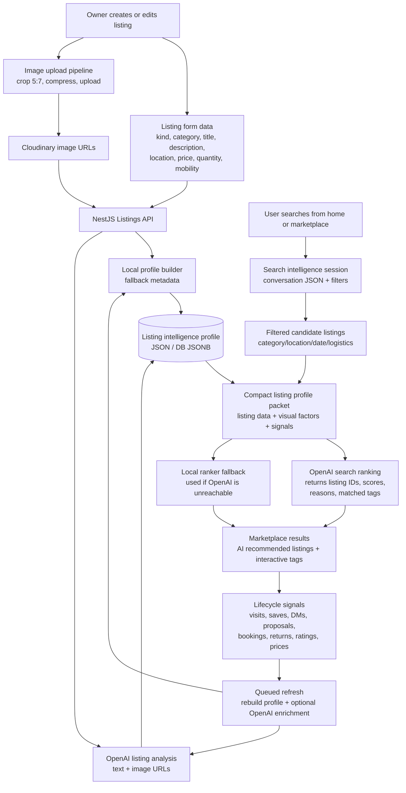

# RentOrbit Architecture

RentOrbit is a countrywide Kenyan rental marketplace for goods, services, spaces, and personnel. The current implementation is a TypeScript monorepo with a Next.js PWA, NestJS API, shared domain package, Kubernetes manifests, and an intelligence layer that enriches listings and ranks search results.

## Site Relationships

## Kubernetes Deployment Landscape

## Intelligence Lifecycle

## How Listing Intelligence Is Harvested

When a creator lists an item, the API stores the listing and queues intelligence analysis. The first profile is built locally so the listing remains usable even if OpenAI is unreachable. When `OPENAI_API_KEY` is configured, the API sends the listing text, metadata, and up to eight image URLs to OpenAI. OpenAI returns compact JSON with:

- searchable need tags
- visible subject per image
- age, condition, damage, repair, and cleanliness markers
- space markers such as walls, windows, tiles, lighting, yards, rooms, or halls
- commercial context such as rating and demand signals

The resulting profile is stored against the listing. In the current development app this is written under `apps/api/data/intelligence/listings`. In production this should be persisted in PostgreSQL JSONB, object storage, or a dedicated search/vector store so pods can be restarted safely.

## How Search Intelligence Works

When a user searches, the web app opens or continues a search intelligence session. The API gathers:

- the user query
- filters such as category, county, dates, radius, and delivery
- the recent session conversation
- candidate listings after hard marketplace filters
- each candidate listing's compact intelligence profile

If OpenAI is reachable, OpenAI receives that packet and returns the exact listing IDs to display, with scores, reasons, and matched tags. The UI shows those listings and exposes the matched tags as clickable AI filters. If OpenAI is missing, slow, or unreachable, RentOrbit falls back to the local ranker in `packages/shared`.

## Production Behavior

This is not limited to seeded development images. For production listings:

- uploaded images should first be normalized by the crop/compression pipeline
- final images should be stored in Cloudinary or equivalent public/private object storage
- OpenAI should receive signed or accessible image URLs during listing analysis
- the returned intelligence profile should be stored with that listing
- search should use compact stored intelligence profiles, not re-analyze images on every search
- lifecycle events should keep updating the profile as users save, message, book, return, rate, dispute, or agree on price

For large-scale production, the API should not send millions of profiles to OpenAI in one request. It should first apply hard filters and retrieval, then send a bounded candidate packet controlled by `INTELLIGENCE_SEARCH_CANDIDATE_LIMIT`. That keeps search fast, cheaper, and still grounded in real listing intelligence.

## Current Fallbacks And Guarantees

- Listing analysis falls back to local metadata if OpenAI is unavailable.
- Search ranking falls back to local ranking if OpenAI is unavailable.
- Search sessions expire after `INTELLIGENCE_SESSION_TTL_MS`.
- Candidate packet size is controlled by `INTELLIGENCE_SEARCH_CANDIDATE_LIMIT`.
- The local ranker ignores filler grammar and requires concrete listing signals, so fallback behavior remains reasonable.
